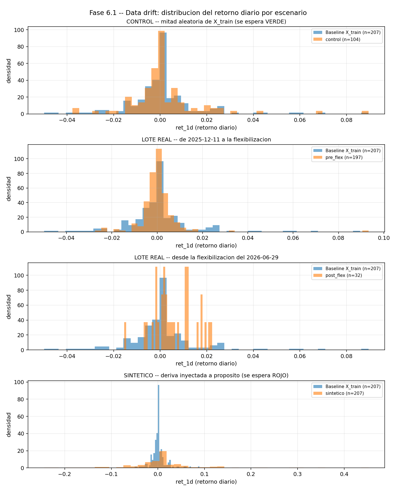
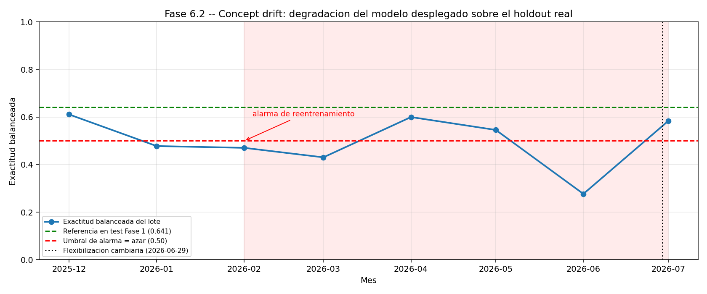

# Fase 6 — Data drift y concept drift

Resultados de correr `src/monitor_data_drift.py` y `src/monitor_concept_drift.py`
sobre datos reales del mercado P2P boliviano.

- **Baseline:** el `X_train` exacto de la versión 1 — 207 días, hasta 2025-12-11
- **Holdout:** 2025-12-12 a 2026-07-31, sin tocar durante el entrenamiento
- **Evento del período:** el 29 de junio de 2026 el BCB abandona el tipo de
  cambio fijo de 6,96 Bs vigente desde 2011 (Resolución de Directorio 88/2026).
  El TCO pasa de 9,73 a 12,15 Bs en un mes.

Todo lo que sigue está en `evidencia/evidencia_deriva.txt` y en los gráficos de
`resultados/`.

---

## 6.1 Data drift

### Qué prueba se aplica a cada variable, y por qué

**Kolmogorov-Smirnov para las 6 variables continuas.** Son retornos y
desviaciones relativas: valores reales con infinitos valores posibles. KS
compara las dos funciones de distribución acumulada completas y se queda con
la máxima distancia entre ellas. No supone ninguna forma de distribución, algo
clave acá porque los retornos cambiarios tienen colas mucho más pesadas que
una normal.

**PSI para las 2 variables discretas.** `dia_semana` toma 7 valores y
`es_fin_semana` toma 2. Aplicarles KS no tiene sentido: la acumulada de una
variable binaria es una escalera de dos peldaños. PSI compara directamente las
frecuencias de cada categoría.

Un detalle de implementación: la versión habitual de PSI reparte los datos en
deciles, lo que sobre una variable discreta produce intervalos vacíos o
repetidos. `calcular_psi_discreto` trabaja sobre las categorías observadas, e
incluye la unión de categorías de ambos lotes para que la desaparición de una
categoría cuente como deriva en lugar de ignorarse.

### Umbrales, y de dónde salen

| Prueba | Umbral | Origen |
|---|---|---|
| KS | α = 0,05 | Nivel de significancia estándar: 5% de falsas alarmas por azar |
| PSI | 0,10 / 0,25 | Umbrales consolidados en riesgo crediticio, donde nació el índice |

Los reportes muestran siempre el **estadístico** KS junto al p-valor. La razón:
el p-valor se vuelve más sensible cuanto más grande la muestra, así que con
miles de observaciones hasta diferencias irrelevantes salen significativas. El
estadístico (de 0 a 1) es el tamaño del efecto y sí es comparable entre lotes
de distinto tamaño.

### Resultados

| Escenario | n | Veredicto | Código de salida |
|---|---|---|---|
| Control — mitad aleatoria del baseline | 104 | **VERDE** | 0 |
| Holdout previo a la flexibilización | 197 | **ROJO** | 1 |
| Holdout posterior a la flexibilización | 32 | **ROJO** | 1 |
| Deriva inyectada a propósito | 207 | **ROJO** | 1 |

**Control (verde).** Las 8 variables estables, con estadísticos KS entre 0,031
y 0,065 y p-valores por encima de 0,90:

```
KS   ret_1d           estadistico=0.0590  p=9.539e-01   -> estable
KS   ret_3d           estadistico=0.0308  p=1.000e+00   -> estable
KS   ret_7d           estadistico=0.0460  p=9.964e-01   -> estable
KS   vol_7d           estadistico=0.0650  p=9.061e-01   -> estable
KS   desv_media_7d    estadistico=0.0497  p=9.910e-01   -> estable
KS   desv_media_30d   estadistico=0.0437  p=9.983e-01   -> estable
PSI  dia_semana       psi=0.0467                        -> estable
PSI  es_fin_semana    psi=0.0078                        -> estable
```

**Post-flexibilización (rojo).** Cinco de las seis continuas marcan deriva, con
estadísticos entre 0,375 y 0,503 — un orden de magnitud por encima del control:

```
KS   ret_1d           estadistico=0.4360  p=2.719e-05   -> DERIVA
KS   ret_3d           estadistico=0.3755  p=5.223e-04   -> DERIVA
KS   ret_7d           estadistico=0.4834  p=1.920e-06   -> DERIVA
KS   vol_7d           estadistico=0.2415  p=6.487e-02   -> estable
KS   desv_media_7d    estadistico=0.5027  p=5.896e-07   -> DERIVA
KS   desv_media_30d   estadistico=0.4592  p=7.757e-06   -> DERIVA
PSI  dia_semana       psi=0.0277                        -> estable
PSI  es_fin_semana    psi=0.0174                        -> estable
```

### Dos observaciones sobre estos resultados

**Por qué el control es un reparto aleatorio y no `X_test`.** Se probó primero
usar el conjunto de prueba cronológico como caso verde, y marcaba deriva
igual. La razón es que `X_test` es un tramo posterior en el tiempo, y en una
serie cambiaria eso ya trae un cambio de nivel: el test habría fallado sin que
existiera ningún problema real. Con un reparto aleatorio del baseline, las dos
mitades vienen de la misma distribución por construcción, que es exactamente
lo que se necesita para verificar que el detector no produce falsos positivos.

**`vol_7d` no marca deriva post-flexibilización, y es coherente.** La
volatilidad de 7 días es la única continua que se mantiene estable
(estadístico 0,24, p=0,065, justo por encima del umbral). Tiene sentido: el
mercado P2P ya venía volátil antes del cambio de régimen. Lo que cambió fue el
**nivel y la dirección** de los retornos, no tanto su dispersión. Las dos
variables que más se mueven son las de desviación contra la media
(`desv_media_7d` = 0,503 y `desv_media_30d` = 0,459), que es precisamente lo
que capta una devaluación sostenida.

**Las variables de calendario no derivan, y también es coherente.** `dia_semana`
y `es_fin_semana` dan PSI de 0,028 y 0,017. Es lo esperable: los días de la
semana se reparten igual antes y después de una devaluación. Que se mantengan
estables mientras las continuas se disparan es una señal de que el detector
está midiendo lo que corresponde y no reaccionando a cualquier cosa.



---

## 6.2 Concept drift

Data drift es que cambien las entradas. Concept drift es que cambie la
**relación** entre las entradas y la respuesta: las entradas pueden verse
idénticas y aun así el modelo empieza a equivocarse.

Se mide sobre el modelo desplegado, cargado por la misma referencia de
registro que usa el servicio (`models:/tc-usdt-bob-direccion@champion`), no
sobre una copia reentrenada.

- **Métrica:** exactitud balanceada, donde 0,50 es exactamente el azar
- **Referencia:** 0,6410, el desempeño de la v1 en su test cronológico
- **Lotes:** mensuales sobre todo el holdout

### Degradación observada

| Mes | n | % al alza | Exactitud balanceada |
|---|---|---|---|
| 2025-12 | 21 | 57,1% | 0,6111 |
| 2026-01 | 31 | 38,7% | **0,4781** |
| 2026-02 | 27 | 37,0% | **0,4706** |
| 2026-03 | 30 | 63,3% | **0,4306** |
| 2026-04 | 30 | 66,7% | 0,6000 |
| 2026-05 | 31 | 48,4% | 0,5458 |
| **2026-06** | 29 | 41,4% | **0,2770** |
| 2026-07 | 30 | 80,0% | 0,5833 |

El modelo arranca cerca de su referencia (0,611 en diciembre), cae por debajo
del azar durante tres meses seguidos, se recupera parcialmente, y toca su peor
valor en **junio de 2026: 0,277** — el mes exacto de la flexibilización
cambiaria. Un 0,277 no es solo malo: significa que el modelo acierta menos que
tirar una moneda, o sea que sus predicciones inducen decisiones peores que no
tener modelo.



### Criterio de reentrenamiento

> **Alarma si la exactitud balanceada cae por debajo de 0,50 durante 2 meses
> consecutivos.**

**Por qué 0,50.** Es el valor exacto del azar en esta métrica. No es un número
elegido a dedo ni un porcentaje arbitrario de caída respecto de la referencia:
por debajo de 0,50 el modelo dejó de aportar información y pasó a inducir
decisiones peores que una moneda. El umbral tiene significado propio.

**Por qué 2 meses.** Cada lote mensual tiene unos 25 días con etiqueta real.
Con esa cantidad, la métrica de un solo mes se mueve varios puntos por puro
azar. Exigir dos meses consecutivos filtra el ruido sin tardar tanto en
reaccionar como para dejar al modelo tomando malas decisiones durante un
trimestre.

**Con los datos reales la alarma se disparó en 2026-02** (enero 0,478 seguido
de febrero 0,471). Eso es lo que justificó registrar la versión 2.

### Control sintético: ¿el detector funciona?

Se invierten las etiquetas de una fracción creciente del test dejando las
**entradas intactas**, de modo que toda degradación sea concept drift puro. Es
el escenario que sugiere el enunciado ("invirtiendo o reasignando etiquetas en
un subconjunto").

| Invertido | Exactitud balanceada | ¿Dispara? |
|---|---|---|
| 0% | 0,6410 | no |
| 25% | 0,5774 | no |
| 50% | 0,5289 | no |
| 75% | 0,5197 | no |
| **100%** | **0,3590** | **sí** |

**Que con el 50% no dispare no es un fallo del detector.** Con la mitad de las
etiquetas dadas vuelta, el modelo acierta en un tramo y falla en el otro: su
rendimiento real *es* el del azar, y el monitor lo está reportando con
exactitud. Lo que muestra el barrido es que una inversión parcial es el caso
más difícil de detectar, porque se disfraza de ruido. Con inversión total el
detector dispara sin ambigüedad.

---

## 6.3 Del monitoreo al reentrenamiento

La alarma de febrero justificó entrenar una versión nueva incluyendo los datos
posteriores al cambio de régimen. El resultado tiene una lectura que conviene
entender bien:

| | v1 (dic-2025) | v2 (jul-2026) |
|---|---|---|
| Criterio de selección (CV) | 0,5860 | 0,5762 |
| Exactitud balanceada en test | 0,6410 | 0,5685 |
| ROC AUC en test | 0,6213 | 0,5499 |
| Filas de entrenamiento | 207 | 390 |
| Corrida ganadora | `xgboost_cfg2` | `xgboost_cfg3` |

**La v2 puntúa más bajo que la v1, y aun así es la que se desplegó.** No es una
contradicción: **los dos números no son comparables**, porque cada versión se
evalúa sobre un conjunto de prueba distinto.

- El test de la v1 es septiembre–diciembre de 2025: régimen cambiario estable,
  movimientos chicos, comportamiento predecible.
- El test de la v2 cae dentro de 2026: post-devaluación, con el TCO subiendo
  25% en un mes. Es un período genuinamente más difícil de predecir.

Un 0,5685 sobre datos difíciles puede valer más que un 0,6410 sobre datos
fáciles. Y hay un dato que lo zanja: **la v1, medida sobre ese mismo período
difícil, sacó 0,277 en junio.** Es decir, el modelo que "puntúa mejor" es el
que estaba fallando en producción.

Esa es la razón de fondo por la que el monitoreo existe: la métrica del
entrenamiento no dice cómo se va a comportar el modelo cuando el mundo cambie.
Solo el seguimiento sobre datos nuevos lo revela.

La v2 se registró **sin alias**, y la promoción a producción se hizo como un
paso aparte y explícito. Registrar y desplegar son decisiones distintas.

---

## 6.4 Retraso de etiqueta

Todo lo anterior supone que ya se conoce la respuesta correcta de cada día. En
producción eso nunca pasa en el momento de predecir.

En este modelo el retraso es corto: la etiqueta de hoy —si el tipo de cambio
subió o no— se sabe mañana. Es una situación mucho más cómoda que la de un
modelo de riesgo crediticio, donde confirmar un incumplimiento puede tomar
meses. Pero el retraso existe, y con lotes mensuales significa que un mes malo
recién se puede confirmar cuando ya terminó.

Qué se hace mientras tanto:

1. **El monitor de data drift es la alerta temprana.** No necesita etiquetas:
   compara solo las entradas. Si las entradas se van del rango conocido, hay
   motivo para desconfiar del modelo aunque todavía no se pueda medir su
   error. En este proyecto la deriva de entradas fue detectable desde el
   primer lote del holdout, meses antes de poder confirmar la degradación.

2. **Se vigila la distribución de las probabilidades devueltas.** Si el modelo
   empieza a responder casi siempre lo mismo, o se concentra alrededor de 0,5,
   está perdiendo capacidad de discriminar. Tampoco necesita etiquetas.

3. **Se usa el error del lote anterior como estimación del actual.** A esta
   granularidad los regímenes cambiarios cambian en semanas o meses, no de un
   día para otro, así que el último error medido es una aproximación razonable
   mientras llega el definitivo.

4. **Ante la duda, se degrada con cuidado.** La API devuelve siempre la
   probabilidad junto a la dirección, de modo que quien consume pueda
   distinguir una predicción con confianza de una que está cerca del azar.

---

## Cómo reproducir estos resultados

```bash
./scripts/03_pruebas.sh            # 12 pruebas del detector, todas en verde
./scripts/04_monitores_deriva.sh   # los seis escenarios y la evidencia
```

Los monitores son **puertas**, no reportes: terminan con código de salida 0
(verde) o 1 (rojo), de modo que puedan encadenarse en un pipeline y detener un
despliegue.

```
monitor_data_drift.py --escenario control     -> exit 0   VERDE
monitor_data_drift.py --escenario post_flex   -> exit 1   ROJO
monitor_data_drift.py --escenario sintetico   -> exit 1   ROJO
```

Las 12 pruebas de `tests/` verifican que el detector es confiable; los
monitores lo usan como puerta. La separación es intencional: un monitor que se
cae solo no se puede distinguir de un monitor roto.
